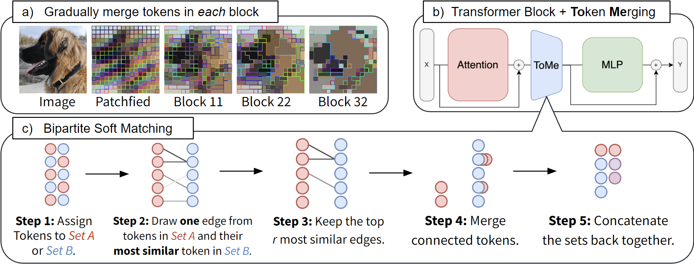
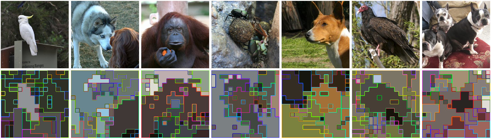

# Token Merging: Your ViT but Faster

Official PyTorch implemention of **ToMe** from our paper: [Token Merging: Your ViT but Faster](https://arxiv.org/abs/2210.09461).  
Daniel Bolya, Cheng-Yang Fu, Xiaoliang Dai, Peizhao Zhang, Christoph Feichtenhofer, Judy Hoffman.

## What is ToMe?


Token Merging (ToMe) allows you to take an existing Vision Transformer architecture and efficiently merge tokens inside of the network for **2-3x** faster evaluation (see [benchmark script](examples/1_benchmark_timm.ipynb)). ToMe is tuned to seamlessly fit inside existing vision transformers, so you can use it without having to do additional training (see [eval script](examples/0_validation_timm.ipynb)). And if you *do* use ToMe during training, you can reduce the accuracy drop even further while also speeding up training considerably.

## What ToMe does



ToMe merges tokens based on their similarity, implicitly grouping parts of objects together. This is in contrast to token pruning, which only removes background tokens. ToMe can get away with reducing more tokens because we can merge redundant foreground tokens in addition to background ones. Visualization of merged tokens on ImageNet-1k val using a trained ViT-H/14 MAE model with ToMe. See [this example](examples/2_visualization_timm.ipynb) for how to produce these visualizations. For more, see the paper appendix.


## Installation
See [INSTALL.md](INSTALL.md) for installation details.


## Usage

This repo does not include models or training code. Instead, we provide a set of tools to patch existing vision transformer implementations. Then, you can use those implementations out of the box. Currently, we support the following ViT implementations:
 - [x] [🔗](#using-timm-models) [timm](https://github.com/rwightman/pytorch-image-models)
 - [x] [🔗](#using-swag-models-through-torch-hub) [swag](https://github.com/facebookresearch/SWAG)
 - [x] [🔗](#training-with-mae) [mae](https://github.com/facebookresearch/mae)
 - [ ] [🔗](#applying-tome-to-stable-diffusion) [stable diffusion](https://github.com/CompVis/stable-diffusion) (coming soon)
 - [ ] [pyslowfast](https://github.com/facebookresearch/SlowFast) (coming soon)

See the `examples/` directory for a set of usage examples.

### Using timm models

[Timm](https://github.com/rwightman/pytorch-image-models) is a commonly used implementation for vision transformers in PyTorch. As of version 0.4.12 it currently uses [AugReg](https://github.com/google-research/vision_transformer) weights.

```py
import timm, tome

# Load a pretrained model, can be any vit / deit model.
model = timm.create_model("vit_base_patch16_224", pretrained=True)
# Patch the model with ToMe.
tome.patch.timm(model)
# Set the number of tokens reduced per layer. See paper for details.
model.r = 16
```

Here are some expected results when using the timm implementation *off-the-shelf* on ImageNet-1k val using a V100:

| Model          | original acc | original im/s |  r | ToMe acc | ToMe im/s |
|----------------|-------------:|--------------:|:--:|---------:|----------:|
| ViT-S/16       |        81.41 |           953 | 13 |    79.30 |      1564 |
| ViT-B/16       |        84.57 |           309 | 13 |    82.60 |       511 |
| ViT-L/16       |        85.82 |            95 |  7 |    84.26 |       167 |
| ViT-L/16 @ 384 |        86.92 |            28 | 23 |    86.14 |        56 |

See the paper for full results with all models and all values of `r`.


### Using SWAG models through Torch Hub

[SWAG](https://github.com/facebookresearch/SWAG) is a repository of massive weakly-supervised ViT models. They are available from Torch Hub and we include a function to patch its implementation.

```py
import torch, tome

# Load a pretrained model, can be one of ["vit_b16_in1k", "vit_l16_in1k", or "vit_h14_in1k"].
model = torch.hub.load("facebookresearch/swag", model="vit_b16_in1k")
# Patch the model with ToMe.
tome.patch.swag(model)
# Set the amount of reduction. See paper for details.
model.r = 45
```

Here are some results using these SWAG models *off-the-shelf* on ImageNet-1k val using a V100:

| Model          | original acc | original im/s |  r | ToMe acc | ToMe im/s |
|----------------|-------------:|--------------:|:--:|---------:|----------:|
| ViT-B/16 @ 384 |        85.30 |          85.7 | 45 |    84.59 |     167.7 |
| ViT-L/16 @ 512 |        88.06 |          12.8 | 40 |    87.80 |      26.3 |
| ViT-H/14 @ 518 |        88.55 |           4.7 | 40 |    88.25 |       9.8 |

Full results for other values of `r` are available in the paper appendix.


### Training with MAE

We fine-tune models models pretrained with MAE using the [official MAE codebase](https://github.com/facebookresearch/mae). Apply the patch as shown in [this example](examples/4_example_mae.py) and set `r` as desired (see paper appendix for full list of accuracies vs `r`). Then, follow the instructions in the MAE code-base to fine tune your model from pretrained weights.

Here are some results *after training* on ImageNet-1k val using a V100 for evaluation:

| Model          | original acc | original im/s |  r | ToMe acc | ToMe im/s |
|----------------|-------------:|--------------:|:--:|---------:|----------:|
| ViT-B/16       |        83.62 |           309 | 16 |    81.91 |       603 |
| ViT-L/16       |        85.66 |            93 |  8 |    85.05 |       183 |
| ViT-H/14       |        86.88 |            35 |  7 |    86.47 |        63 |


### Applying ToMe to Stable Diffusion

[Stable Diffusion](https://github.com/CompVis/stable-diffusion) is a large open-source text-to-image model that uses a transformer unet backbone. ToMe can be applied to the unet model to increase inference speed and reduce memory usage. An implementation of ToMe for Stable Diffusion is on its way, but for now here are some 4k (3840x2176) wallpapers generated natively in PyTorch on one 4090 GPU with stable diffusion + ToMe in under 2 minutes:


See [examples](examples/images/wallpapers/) for more.

Of course, running stable diffusion at this size is kind of rediculous. We present these results to emphasize the power of ToMe to decrease memory usage and speed up evaluation, even at insane image resolutions. Stable Diffusion was trained on 512px images, so we don't actually recommend natively generating at 4k (you should upscale or inpaint instead).

## License and Contributing

Please refer to the [LICENSE](LICENSE). For contributing, see [contributing](CONTRIBUTING.md) and the [code of conduct](CODE_OF_CONDUCT.md).

## Citation
If you use ToMe or this repository in your work, please cite:
```
@article{bolya2022tome,
  title={Token Merging: Your {ViT} but Faster},
  author={Bolya, Daniel and Fu, Cheng-Yang and Dai, Xiaoliang and Zhang, Peizhao and Feichtenhofer, Christoph and Hoffman, Judy},
  journal={arXiv:2210.09461 [cs.CV]},
  year={2022}
}
```
